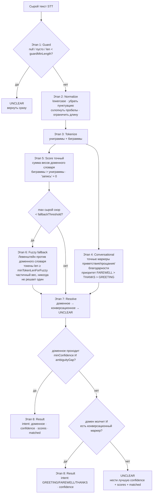

# Пайплайн — МедЗвон

**Раскрывает:** `roadmap.md` §3 и артефакт **«рассуждение»**
**Цель:** полная спецификация этапов (цель / входы / выходы / ключевая логика / почему в этом месте), эссе «почему такой порядок», обоснование метода сопоставления и черновик mermaid-схемы, который сдаётся как `docs/schema.mmd`.

---

## Спецификация по этапам

### Этап 1 — Guard

| | |
|---|---|
| **Цель** | Отсеять непригодный вход немедленно, до любой работы. |
| **Входы** | сырой `text` (string \| null \| undefined \| что угодно). |
| **Выходы** | решение: передать (обрезанную) строку в Normalize, ИЛИ короткое замыкание в `UNCLEAR`. |
| **Ключевая логика** | Если `text` не строка, или после trim пусто, или длина `< guardMinLength` → `UNCLEAR`. Никогда не throw. |
| **Почему здесь** | Это максимально дешёвый тест, и coding-standards его требуют (пусто/null → `UNCLEAR`, не throw). Делая его первым, мы не тратим нормализацию/токенизацию на мусор и гарантируем тотальную функцию (ни одно исключение не выходит из `classify`). |

### Этап 2 — Normalize

| | |
|---|---|
| **Цель** | Сделать сопоставление нечувствительным к регистру/форме и ограничить последующую работу. |
| **Входы** | обрезанная строка из Этапа 1. |
| **Выходы** | чистая строка: в нижнем регистре, без пунктуации, внутренние пробелы схлопнуты в одиночные, обрезана до `maxInputLen`. |
| **Ключевая логика** | Lowercase; убрать пунктуацию (оставить буквы, цифры, пробелы); схлопнуть серии пробелов в один; trim; обрезать до `maxInputLen`. Все операции — одиночные линейные проходы; любая регулярка — литеральный паттерн класса символов (ReDoS-безопасная). |
| **Почему здесь** | Должна идти **до** токенизации, потому что токенизация зависит от чистых границ слов. Нельзя надёжно разбить «приём,» на токен, совпадающий с «приём», пока не убрана пунктуация, и нельзя сопоставлять нечувствительно к регистру, пока регистр не свёрнут. Нормализуя один раз, в начале, каждый последующий этап работает с канонической формой и никогда не пере-чистит. |

### Этап 3 — Tokenize

| | |
|---|---|
| **Цель** | Выдать единицы сопоставления: униграммы и биграммы. |
| **Входы** | нормализованная строка. |
| **Выходы** | `{ unigrams: string[], bigrams: string[] }` — биграммы это соседние пары униграмм, соединённые одиночным пробелом. |
| **Ключевая логика** | Разбить по пробелам на униграммы; спарить соседние униграммы в биграммы. Один токен → одна униграмма, без биграмм; пусто → обе пусты. |
| **Почему здесь** | Токены — единицы, которые скорер сопоставляет со словарём. Биграммы производятся здесь (не в скорере), чтобы скоринг оставался простой суммой по членству в множестве, а список «что совпало» был точным. Критично: **биграммы — это то, как ловятся разорванные слова**: STT-артефакт «за писаться» сам по себе является записью-биграммой `BOOK`, поэтому явный шаг «склейки разорванных слов» не нужен. |

### Этап 4 — Conversational

| | |
|---|---|
| **Цель** | Распознать конверсационное намерение (приветствие/прощание/благодарность) по точным маркерам — отдельно от доменного намерения. |
| **Входы** | `{ unigrams, bigrams }`. |
| **Выходы** | `conversation` — `GREETING` / `FAREWELL` / `THANKS` / `null`. |
| **Ключевая логика** | Точное совпадение токенов (униграмм и биграмм) с маркерами `CONVERSATION`. Если совпали маркеры нескольких классов — класс с наибольшим приоритетом (`FAREWELL` > `THANKS` > `GREETING`). Если маркеров нет — `null`. «алё»/«ало» не маркеры. |
| **Почему здесь** | Нужны токены → после tokenize. Это самое дешёвое из доказательств (точное совпадение), и оно семантически отделено от доменного скоринга: конверсационные маркеры не взвешиваются и не влияют на доменные скоры. Решение, кто выиграет — доменное или конверсационное, — откладывается на Resolve, потому что доменное должно доминировать, а его силу нельзя узнать до скоринга. |

### Этап 5 — Score (точное совпадение)

| | |
|---|---|
| **Цель** | Основной, дешёвый, детерминированный сигнал: сумма весов записей словаря, которые токены совпали точно. |
| **Входы** | `{ unigrams, bigrams }` и определения намерений (`INTENTS`). |
| **Выходы** | `{ scores, matched }` — по-намерению суммы весов и список сработавших строк записей. |
| **Ключевая логика** | Для каждого скоримого намерения, для каждой его записи `unigrams`: если токен есть в `unigrams`, добавить его вес и записать. Для каждой записи `bigrams`: если фраза есть в `bigrams`, добавить её (больший) вес и записать. Веса биграмм > весов униграмм. Родовое существительное вроде «запись» слабое/≈0, чтобы не сработало `BOOK` на высказывании `CANCEL`/`RESCHEDULE`. |
| **Почему здесь** | Точное сопоставление ≈ `O(|tokens| + |vocab|)` и переиспользует предвычисленный словарь — это правильная **первая** попытка. Оно захватывает чистые кейсы (1–4, 5, 7, 8) и большую часть структуры испорченных кейсов. Только когда этот сигнал слаб, мы платим за фаззи-сопоставление. |

### Этап 6 — Fuzzy fallback

| | |
|---|---|
| **Цель** | Восстановить улики, которые точное сопоставление пропустило, через приблизительное сходство строк — **без** словаря замен. |
| **Входы** | `{ unigrams, bigrams }`, `INTENTS`, `thresholds`; запускается только если `max(scores) < fallbackThreshold`. |
| **Выходы** | частичные `{ scores, matched }` **дельты** для слияния с точными скорами. |
| **Ключевая логика** | Для каждой униграммы с `length ≥ minTokenLenForFuzzy` вычислить расстояние Левенштейна до каждой записи словаря; `partialWeight = (1 − distance/len) × entryWeight`; добавить, где очищен небольшой пол. Пропустить токены, уже совпавшие точно (нет двойного счёта). Граница: `|tokens| × |vocab|`, оба малы. |
| **Почему здесь** | Фаззи **дорог относительно точного** и **вероятностен по духу** (сходство, а не тождество), поэтому запускается только на фолбэке и только против малого словаря — никогда против открытого лексикона. Именно здесь фонетические путаницы получают *поддерживающую* улику: «принести» (Левенштейн 1 от «перенести») добавляет частичный вес в `RESCHEDULE`. По ключевому принципу, это **дополняет** контекст (например, сильную униграмму «вместо») — никогда не решает намерение один. |

### Этап 7 — Resolve

| | |
|---|---|
| **Цель** | Решить намерение — доменное, конверсационное, или отказаться (`UNCLEAR`). |
| **Входы** | слитые `scores`, по-намерению `referenceScore`, `conversation`, `minConfidence`, `ambiguityGap`, `domainSilenceThreshold`, `conversationalConfidence`. |
| **Выходы** | `intent` (одно из 10) и `confidence` (0..1). |
| **Ключевая логика** | Двухуровневый резолвер. **Уровень 1 — доменный:** `confidence_i = clamp(score_i / referenceScore_i, 0, 1)`; взять `top1`, `top2`. Если `confidence_top1 ≥ minConfidence` И `confidence_top1 − confidence_top2 ≥ ambiguityGap` → `intent = top1`, `confidence = confidence_top1`. **Уровень 2 — конверсационный:** иначе если `max(scores) < domainSilenceThreshold` И `conversation ≠ null` → `intent = conversation`, `confidence = conversationalConfidence`. **Уровень 3 — иначе** → `UNCLEAR`. |
| **Почему здесь** | Решение должно идти **после** сбора всех улик (конверсационные маркеры, точные + фаззи), никогда в середине пайплайна. Разделение на *абсолютную силу* (`minConfidence`) и *доминантность* (`ambiguityGap`) делает философию строгого `UNCLEAR` рабочей. Уровневая логика «доменное доминирует над конверсационным» означает, что «здравствуйте хочу записаться» даёт `BOOK`, а не `GREETING`, а чистое «спасибо до свидания» — `FAREWELL`. Это прямой ответ на «есть ли честный путь для низкой уверенности, или система всегда угадывает?» — есть, и он по умолчанию. |

### Этап 8 — Result

| | |
|---|---|
| **Цель** | Выдать полный, отлаживаемый, пригодный для диалогового движка результат. |
| **Входы** | `intent`, `confidence`, `scores`, `matched`. |
| **Выходы** | `{ intent, confidence, scores, matched }`. |
| **Ключевая логика** | Собрать объект. Для `UNCLEAR` сохранить уверенность лучшего отвергнутого кандидата и полные `scores`/`matched`, чтобы вызывающий видел, *почему* было неясно. |
| **Почему здесь** | Бриф просит полную картину (уверенность + что совпало), а нижележащему диалоговому движку нужны оба, чтобы выбрать между переспросить-эскалировать-подсказать. Централизация формы здесь держит публичный контракт стабильным. |

---

## Эссе — почему этапы в таком порядке

Пайплайн — это **поэтапный накопитель улик**, упорядоченный одним правилом: **отсеять дёшево, почистить один раз, собрать дешёвые точные улики, эскалировать в дорогой фаззи только когда нужно, решать последним.**

1. **Guard первым**, потому что он `O(1)`, а стандарты требуют тотальной функции. Каждый цикл, потраченный на нормализацию `null`, выброшен; каждое исключение — баг. Guard делает `classify` тотальной и дешёвой на мусоре.

2. **Normalize до tokenize**, потому что токенизация зависит от чистых границ. Нельзя надёжно разбить «приём,» на токен, совпадающий с «приём», пока не убрана пунктуация, и нельзя сопоставлять нечувствительно к регистру, пока регистр не свёрнут. Нормализуя один раз, в начале, каждый последующий этап работает с канонической формой и никогда не пере-чистит.

3. **Tokenize до score и до conversational**, потому что и скорер, и детектор конверсационных маркеров сопоставляют пред-собранные единицы. Производя биграммы здесь (а не внутри скорера/детектора), мы держим их чистыми и делаем списки «что совпало» точными. Здесь же живёт **стратегия разорванных слов**: STT-артефакт «за писаться» является биграммой словаря, поэтому система ловит разрывы *как фразы* без явного, хрупкого шага «склейки слов» (который был отброшен именно потому, что склейщику понадобился бы свой, склонный к ошибкам словарь).

4. **Conversational до resolve (и параллельно доменному скорингу)**, потому что это самое дешёвое доказательство — точное совпадение маркеров, без весов и фаззи. Его результат не влияет на доменные скоры (маркеры приветствия/прощания/благодарности не входят в доменный словарь), поэтому порядок относительно Score неважен. Важно лишь, что **решение** между доменным и конверсационным принимается в Resolve, а не здесь: доменное должно доминировать, а его силу нельзя узнать, пока скоринг не завершён.

5. **Точный скоринг до фаззи**, потому что точное сопоставление дешёво, детерминированно и переиспользует курируемый словарь — оно решает чистые кейсы (1–4) и большую часть структуры испорченных (5, 7, 8) сразу. Эскалация в фаззи только при слабости точного держит общий путь быстрым и удерживает вероятностное по духу сходство в трудных кейсах.

6. **Фаззи только на фолбэке**, потому что Левенштейн дороже и даёт *частичные* (сходство) улики, а не тождество. Запускать его всегда — значит пускать шум в каждое решение. Запускать только при `max < fallbackThreshold` — значит улика сходства появляется ровно тогда, когда точных улик недостаточно — и даже тогда он **добавляет** к скорам, а не решает, так что одна фонетическая путаница не может перевернуть намерение сама.

7. **Resolve последним**, потому что решение должно взвешивать *все* улики: доменные (точные + фаззи) и конверсационные. Решая раньше, мы замёрзли бы на слабом точном скоре до того, как фаззи мог помочь, или на конверсационном маркере до того, как доменный контекст («вместо») был посчитан. Уровневая логика — сначала доменное (с абсолютным `minConfidence` и относительным `ambiguityGap`), потом конверсационное (при молчащем домене), потом `UNCLEAR` — формальная версия «лучше переспросить, чем ввести в заблуждение»: слабый победитель отказывается, и почти-ничья отказывается.

8. **Result последним**, чтобы держать контракт вывода в одном месте и нести *причину* `UNCLEAR` вперёд, чтобы диалоговый движок мог выбрать переспросить / эскалировать / подсказать, а не получать голую метку.

Этот порядок — противоположность «одного большого `if/else`»: у каждого этапа одна ответственность, определённые вход/выход и ясная причина быть там, где он есть.

---

## Эссе — почему взвешенный скоринг + биграммы, а не один большой if/else

Гигантский `if/else` по ключевым словам — ровно то, от чего предостерегает бриф («не один большой if/else без структуры»). У него три режима отказа, которые чинят взвешенный скоринг + биграммы:

- **Он хрупок на STT-порче.** `if (text.includes('записаться'))` пропустит «за писаться». Биграмма-запись `за писаться` с весом ловит её как первоклассный сигнал, и агрегат всё равно работает.
- **Он не умеет выражать «слабая vs сильная» улика.** «запись» встречается в `BOOK`, `CANCEL` и `RESCHEDULE`. `if/else` должен либо всегда срабатывать `BOOK` (неверно на `CANCEL`/`RESCHEDULE`), либо быть закапан всё более глубокой вложенностью. Веса позволяют «запись» быть ≈0, пока «отменить запись» (биграмма) и «отменить» (глагол) сильны — *комбинация* идентифицирует намерение, а не одно ключевое слово.
- **У него нет честного пути низкой уверенности.** `if/else` либо совпадает, либо нет; он не может сказать «слабо и неоднозначно». Скоры + пороги дают непрерывную уверенность и разрыв доминантности, что и делает строгий `UNCLEAR` возможным.

Биграммы весомее униграмм именно потому, что **фраза** гораздо более дизамбигуирующая, чем слово: «отменить запись» однозначно; «запись» одна — нет. Взвешенная агрегация превращает «мешок улик» в решение, которое деградирует плавно — когда улики слабы или конфликтуют, резолвер отказывается, вместо того чтобы угадывать.

---

## Эссе — почему фонетические путаницы НЕ исправляются словарём

Исходный план рассматривал «словарь STT-исправлений» (маппинг «принести»→«перенести»). Он был **отброшен** по точной причине: пары вроде «принести ↔ перенести» — это **фонетическая неоднозначность с разными смыслами**, а не опечатки с известным исправлением.

- «принести» — реальное слово («принести справку в клинику»). Словарь, переписывающий его в «перенести», тихо испортил бы валидные `INFO`/`BOOK`-высказывания в `RESCHEDULE`.
- Нет контекстно-свободного маппинга. Имелось ли в виду «принести» как «перенести», зависит от окружающих слов («…запись … вместо» → да; «…справку» → нет).
- Таблица замен ещё и неподдерживаема: каждая фонетически похожая пара с расходящимися смыслами потребовала бы записей, и каждая запись — латентная ошибка классификации.

Выбранная альтернатива: **решают контекст + фаззи-сходство, никогда не перезапись.** Точный скоринг захватывает сигналы контекста (сильную униграмму «вместо», биграмму «перенести запись»). Фаззи-фолбэк добавляет *частичный*, нерешающий вес, когда «принести» Левенштейн-близко к «перенести». Вместе они подталкивают `RESCHEDULE` только когда остальные улики согласны. Если присутствует только «принести» без контекста, строгий резолвер возвращает `UNCLEAR` — что корректно: система переспрашивает вместо угадывания.

Поэтому же **разорванные слова не склеиваются явно**: склейщик — это ещё один словарь под другой личиной. Вместо этого артефакт-разрыв «за писаться» зарегистрирован как биграмма `BOOK`, так что сопоставитель фраз ловит его напрямую.

---

## Эссе — почему приветствие/прощание/благодарность — отдельный шаг

Исходный план «сливал» эти три класса в `UNCLEAR` (строгие пороги естественно обнуляют их скор). Но для диалогового движка это разные вещи: «здравствуйте» — разговор только начался, «спасибо» — подтверждение помощи, «до свидания» — терминальное завершение. Поэтому они выделены в отдельный шаг и три полноценных намерения.

Причины выделить их отдельно от доменного скоринга:

- **Семантически другой тип сигнала.** Доменные намерения — взвешенные фразы + фаззи; конверсационные — короткий точный список маркеров, без взвешивания. Смешивать их в одном словаре значило бы либо давать им ложные веса, либо тащить бинарную логику в взвешенный скоринг.
- **Доменное всегда доминирует.** «здравствуйте хочу записаться» — это `BOOK`, а не `GREETING`. Если бы приветствие участвовало в скоринге наравне с доменными, оно шумело бы в каждом решении. Отдельный шаг + уровневая резолвация делают правило явным: конверсационное намерение возвращается только когда доменных улик нет вовсе.
- **Приоритет при смешанных маркерах.** «спасибо до свидания» несёт и благодарность, и прощание. Фиксированный порядок `FAREWELL` > `THANKS` > `GREETING` разрешает это в одно намерение по простому правилу: прощание терминально (завершает разговор), благодарность важнее приветствия.
- **Консервативный словарь маркеров.** «алё»/«ало» намеренно исключены: на телефонном звонке это может быть приветствием, но в «ыаыы ало алё» это шум. Исключая неоднозначные с шумом формы, мы сохраняем `UNCLEAR` для бессмыслицы (пример 10) и не ломаем бриф.

---

## Эссе — что происходит при низкой уверенности

Резолвер трёхуровневый: доменное → конверсационное → `UNCLEAR`. Два порога управляют доменным уровнем, оба — выражения «лучше переспросить, чем ввести в заблуждение»:

- **Абсолютная слабость** (`confidence_top1 < minConfidence`): даже лучшее доменное намерение не поддержано сильно. Это ловит бессмыслицу («ыаыы ало алё» → все скоры 0).
- **Неоднозначность** (`confidence_top1 − confidence_top2 < ambiguityGap`): два доменных намерения почти сравнялись. Это страховочная сеть для фонетических путаниц, которые *почти* подходят под два смысла.

Когда доменное не проходит оба порога и домен «молчит» (`max(scores) < domainSilenceThreshold`), но есть конверсационный маркер, система возвращает конверсационное намерение (`GREETING`/`FAREWELL`/`THANKS`) с постоянной `conversationalConfidence` — это не «угадывание», а точное совпадение маркера. «спасибо до свидания» → `FAREWELL` (приоритет прощания над благодарностью).

И только когда нет ни доменного, ни конверсационного — `UNCLEAR`. На `UNCLEAR` система **не** стирает свою работу: она возвращает уверенность лучшего отвергнутого кандидата и полные `scores`/`matched`. Диалоговый движок использует это для выбора: переспросить, эскалировать оператору или предложить подсказку («вы хотели записаться или перенести?»). Открытие уверенности — а не возврат только метки — то, что позволяет вызывающему принять это решение безопасно. Система никогда тихо не угадывает, когда улики слабы или разделены; она поднимает неопределённость наверх.

---

## Черновик mermaid-схемы (сдаётся как `docs/schema.mmd`)

Это **отправная точка** для реализатора. Она должна оставаться читаемой **без** чтения кода: видны каждый этап, каждая ветка и обе точки выхода `UNCLEAR` (guard-fail и resolve-fail).

**Требования к схеме (критерий: «читается ли схема отдельно от кода»):**
- Каждый блок этапа в одну строку говорит, *что происходит* (не просто имя).
- Обе точки `UNCLEAR` нарисованы различаемо (guard-короткое замыкание vs отказ резолвера), а три финальных исхода — доменное намерение, конверсационное намерение, `UNCLEAR` — видны явно.
- Ветка фолбэка и её условие включения явны; этап Conversational виден и ведёт в Resolve отдельной стрелкой.
- Для понимания не требуется ссылок на файлы исходников или имена функций.
- Держать на одном экране; если разрастётся — разбить на «счастливый путь» и подграф «конверсационное/UNCLEAR/низкая уверенность».
